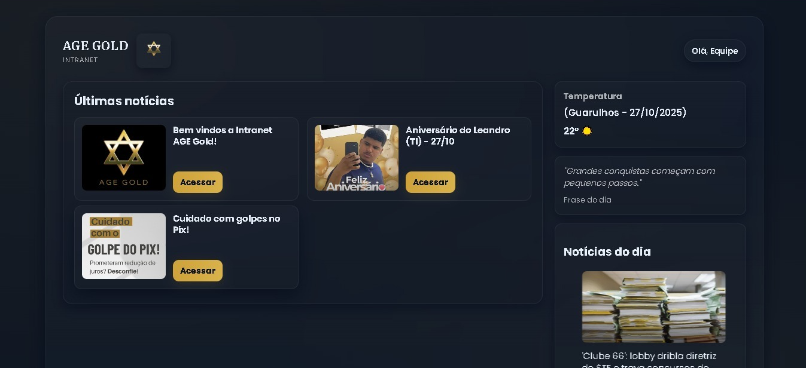

# 🏢 Intranet AGE

Uma intranet interna desenvolvida com **Python (Flask)**, **HTML**, **CSS** e **SQLite** para centralizar notícias internas, comunicados e informações relevantes da empresa, integração com APIs e organização de conteúdo corporativo.

---

## 🚀 Funcionalidades

- 📰 **Gerenciamento de notícias internas**  
  Adicione, liste e apague notícias com título, link e imagem de capa.  

- 🌤️ **Clima em tempo real**  
  Exibe a temperatura atual da cidade, utilizando uma API de clima.  

- 💬 **Frases motivacionais automáticas**  
  A cada acesso à página inicial, uma nova frase motivacional é exibida.  

- 🖼️ **Upload de imagens**  
  Cada notícia pode ter uma imagem personalizada.  

- 💾 **Banco de dados SQLite**  
  Todas as informações são salvas localmente de forma segura e eficiente.  

---

## 🧠 Tecnologias Utilizadas

- **Python (Flask)** — Backend e gerenciamento de rotas  
- **HTML5 & CSS3** — Estrutura e estilo da interface  
- **SQLite** — Banco de dados leve e integrado  
- **Feedparser** — Coleta de notícias externas via RSS  
- **APIs externas** — Clima e frases motivacionais

---

## ⚙️ Como Executar o Projeto

1. **Clone o repositório**
   ```bash
   git clone https://github.com/pedromelomatos/intranet-age.git
   ```

2. **Entre na pasta do projeto**
   ```bash
   cd intranet-age
   ```

3. **Crie e ative um ambiente virtual (opcional, mas recomendado)**
   ```bash
   python -m venv venv
   venv\Scripts\activate   # Windows
   source venv/bin/activate  # Linux/Mac
   ```

4. **Instale as dependências**
   ```bash
   pip install -r requirements.txt
   ```

5. **Execute o servidor Flask**
   ```bash
   python main.py
   ```

6. **Acesse no navegador**
   ```
   http://127.0.0.1:5000
   ```

---

## 📸 Capturas de Tela 

### 🏠 Página Inicial  


### 🛠️ Painel Administrativo  


---

## 📂 Estrutura do Projeto

```
intranet-age/
│
├── static/
│   ├── style.css
│   ├── logo-age.png
│   ├── placeholder-news.png
│   └── ...
│
├── templates/
│   ├── index.html
│   ├── admin.html
│   ├── nova-noticia.html
│   └── ...
│
├── main.py
├── requirements.txt
├── db.py
├── models.py
└── README.md
```

---

✉️ *Desenvolvido por [Pedro Henrique Melo Matos](https://github.com/pedromelomatos)*  
#Python #Flask #DesenvolvimentoWeb #Backend #Projetos #Programação
